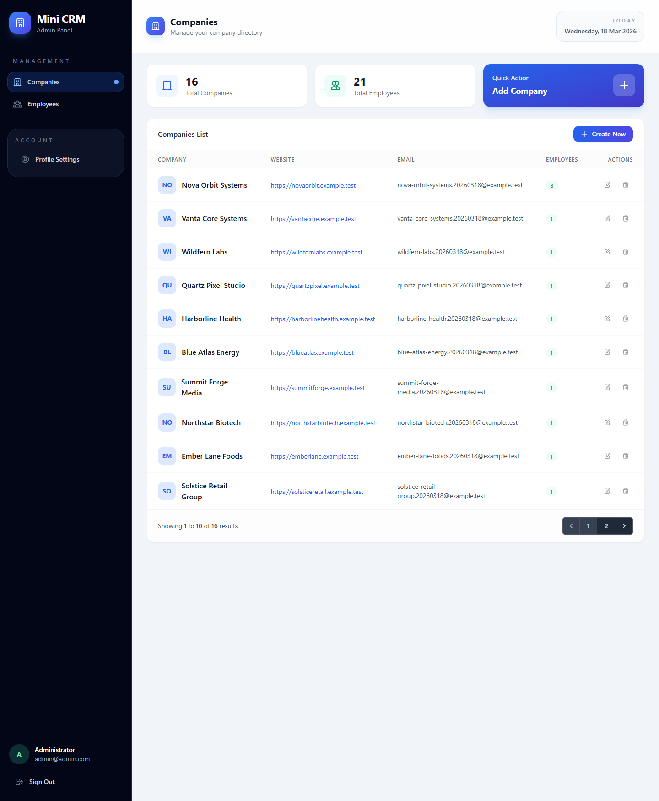
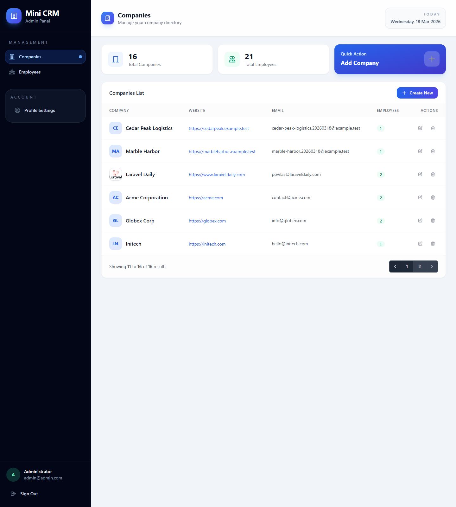
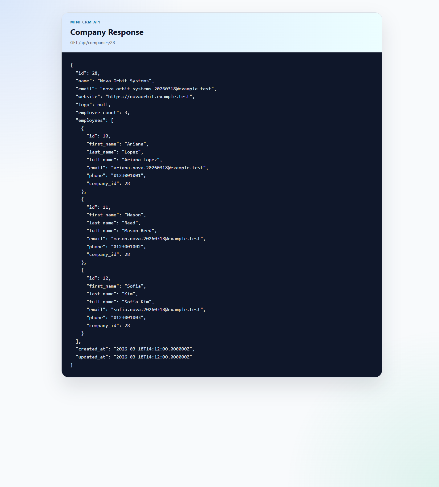

# Mini CRM - Laravel Assessment

This repository contains a Mini CRM admin panel built for the FNXPERTS SDN. BHD. Web Developer Assessment.

The Laravel application lives in `mini-crm/`.

## Delivered Features

- Laravel Breeze authentication with registration disabled
- Seeded administrator account: `admin@admin.com` / `password`
- Companies CRUD with logo upload, validation, and public storage support
- Employees CRUD linked to companies
- Form Request validation for create and update flows
- Database migrations and Eloquent relationships
- Pagination with 10 records per page for companies and employees
- Web routes for the admin panel and API routes for company data
- Read-only API endpoint that returns a company, its employees, and `employee_count`
- Postman collection included at `postman_collection.json`

## Quick Start

Run all commands from `mini-crm/`.

```bash
composer install
cp .env.example .env
php artisan key:generate
```

Update `.env` with your database credentials, then run:

```bash
php artisan migrate --seed
php artisan storage:link
npm install
npm run build
```

Start the backend in one terminal:

```bash
php -S 127.0.0.1:8000 -t public
```

If you want live frontend updates during development, start the frontend in a second terminal:

```bash
npm run dev
```

Open `http://127.0.0.1:8000` and log in with:

- Email: `admin@admin.com`
- Password: `password`

## API

Available endpoints:

- `GET /api/companies`
- `GET /api/companies/{company}`

Example response for `GET /api/companies/1`:

```json
{
  "id": 1,
  "name": "Acme Corporation",
  "email": "contact@acme.com",
  "website": "https://acme.com",
  "logo": null,
  "employee_count": 2,
  "employees": [
    {
      "id": 1,
      "first_name": "John",
      "last_name": "Doe",
      "full_name": "John Doe",
      "email": "john@acme.com",
      "phone": "0123456789",
      "company_id": 1
    }
  ],
  "created_at": "2026-03-17T00:00:00.000000Z",
  "updated_at": "2026-03-17T00:00:00.000000Z"
}
```

Import `postman_collection.json` into Postman to test the API quickly.

## Screenshots

Working UI and API screenshots are included under `docs/screenshots/`:







## Testing

From `mini-crm/`:

```bash
php artisan test
```

## Notes

- Company logos are stored on the `public` disk under `storage/app/public/logos`.
- Uploaded logos require a minimum size of `100x100` and a maximum file size of `2MB`.
- If `php artisan serve` fails on your machine, use `php -S 127.0.0.1:8000 -t public`.
- If you want screenshots versioned with the repository, add them under `docs/screenshots/` before submission.
